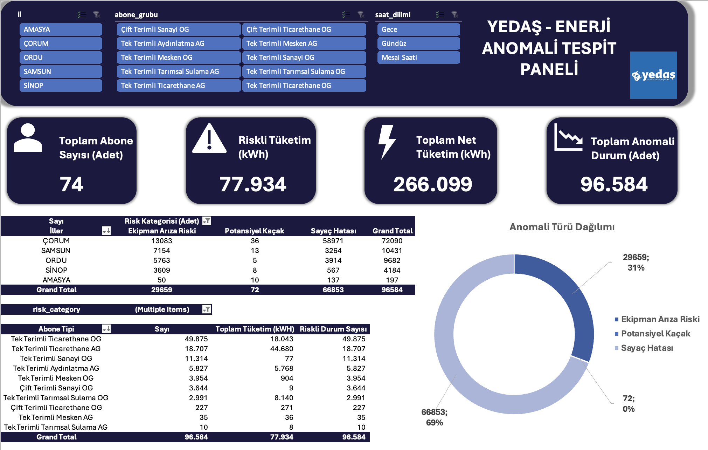
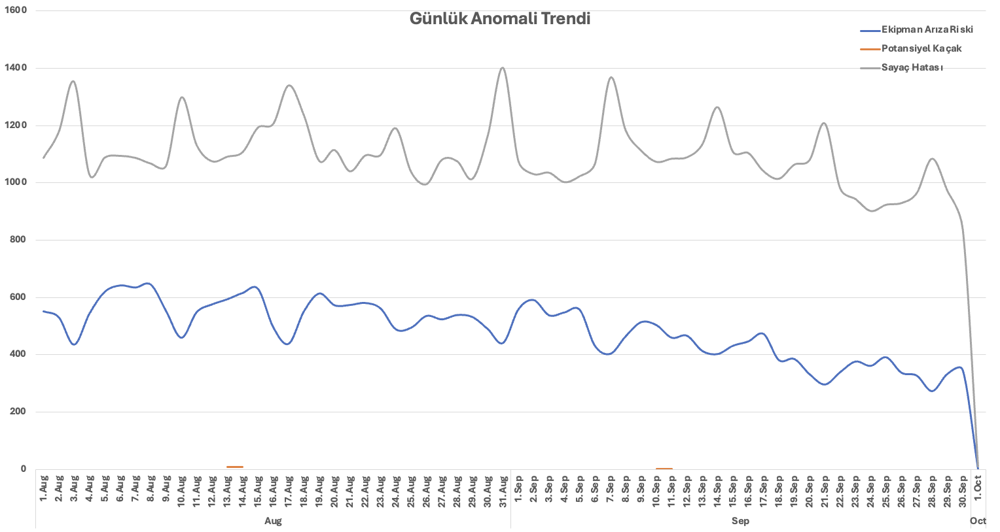
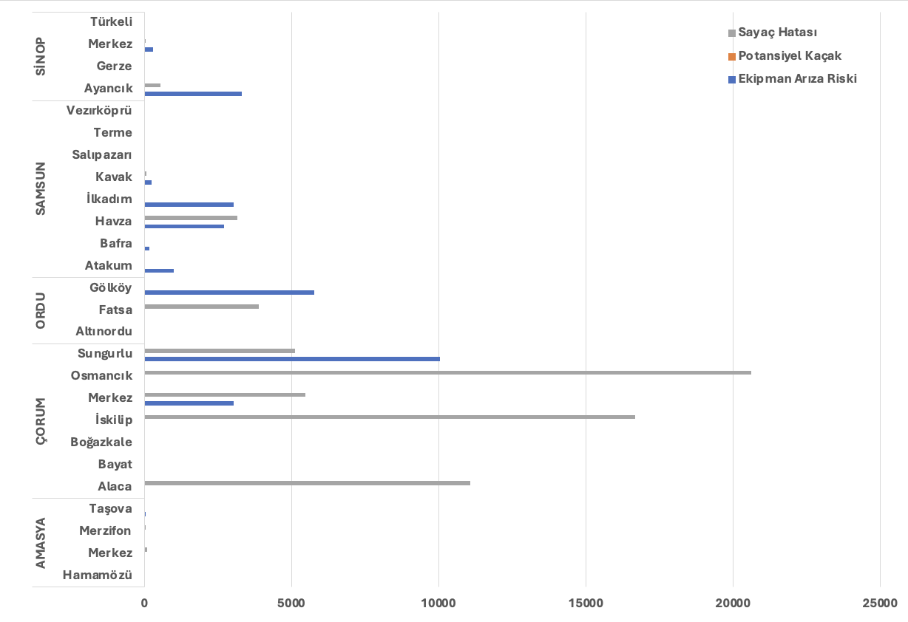

# YEDAS Enerji Anomali Tespit & Operasyonel Takip Paneli (Energy Anomaly Detection Dashboard)

## 📋 Proje Özeti
Bu proje, elektrik dağıtım sektöründe **Kayıp/Kaçak tespiti**, **Sayaç arızaları** ve **Operasyonel verimsizlikleri** veri odaklı analiz etmek amacıyla geliştirilmiştir. Büyük ölçekli tüketim verileri temizlenmiş, zenginleştirilmiş ve interaktif bir Excel Dashboard üzerinden karar destek mekanizmasına dönüştürülmüştür.

Proje sonucunda, **77.934 kWh** tutarında riskli tüketim tespit edilmiştir.

## Temel Özellikler & Analizler

Bu çalışma kapsamında ham veri üzerinde aşağıdaki **Feature Engineering** ve **İstatistiksel Analiz** çalışmaları yapılmıştır:

* **Risk Modellemesi:** Aboneler; "Normal", "Potansiyel Kaçak", "Sayaç Hatası" ve "Ekipman Arızası" olarak 4 ana risk grubuna ayrıldı.
* **Anomali Algoritmaları:**
    * 🚩 **Sabit Sayaç:** Uzun süre boyunca (örn: 20 ardışık okuma) sabit değer üreten sayaçların tespiti.
    * 🌙 **Gece Vakti Kaçak:** Ticarethane/Mesken bazında mesai saatleri dışında olağandışı yüksek tüketim analizi.
    * 🔌 **Faz Kaybı:** Akım geçen ancak gerilimi (voltajı) 0 görünen veya tek fazı kopuk tesisatların tespiti.
    * 👻 **Hayalet Tüketim:** Gerilim verisi < 10V olmasına rağmen aktif tüketim yazan hatalı kayıtlar.
    * ⚡ **Reaktif Ceza Tespiti:** Aktif tüketimi düşük ancak Reaktif (Endüktif/Kapasitif) tüketimi yüksek olan, şebekeyi kirleten aboneler.
* **Dinamik Dashboard:** Slicer'lar ile İl, İlçe ve Abone Grubu bazında anlık filtreleme imkanı.

## Kullanılan Teknolojiler ve Yöntemler

* **Veri İşleme:** Excel
* **Analiz:** Pivot Tables, Time-Series Analysis.
* **Görselleştirme:** Excel Dashboard (Slicers, KPI Cards, Donut & Combo Charts).
* **Performans:** Büyük veri setini yönetmek için `.xlsb` (Binary Workbook) formatı kullanılarak dosya boyutu %50 optimize edilmiştir.
* **Versiyon Kontrolü:** Git & GitHub

## Projeden Çıkarılan İçgörüler (Business Insights)

1.  **Finansal Etki:** Toplamda **96.584** adet anomali kaydı incelenmiş ve **77.934 kWh**'lik potansiyel kayıp enerji tespit edilmiştir.
2.  **Abone Segmentasyonu:** Sanayi ve Ticarethane gruplarındaki reaktif ceza risklerinin, meskenlere göre daha yönetilebilir ancak finansal etkisinin daha yüksek olduğu saptanmıştır.

## 📷 Ekran Görüntüleri

### 1. Ana Dashboard
Yöneticilerin tek bakışta toplam riski, alarm sayısını ve finansal kaybı görebildiği KPI kartları ve özet grafikler.

### 2. Anomali Zaman Serisi Grafiği

### 3. İl ve İlçe Bazlı Anomali Grafiği

---

## Nasıl Çalıştırılır?

1.  Bu repoyu klonlayın veya `.xlsb` dosyasını indirin.
2.  Dosyayı **Microsoft Excel** ile açın (Veri modeli ve Slicer'ların düzgün çalışması için Excel 2016 ve üzeri önerilir).
3.  Dashboard sayfasındaki **Slicer (Dilimleyici)** butonlarını kullanarak "İl" veya "Abone Tipi" seçimi yapın.
4.  Tüm grafiklerin ve KPI kartlarının dinamik olarak güncellendiğini göreceksiniz.

---

**Yazar:** 
[Mert Can Demir]
